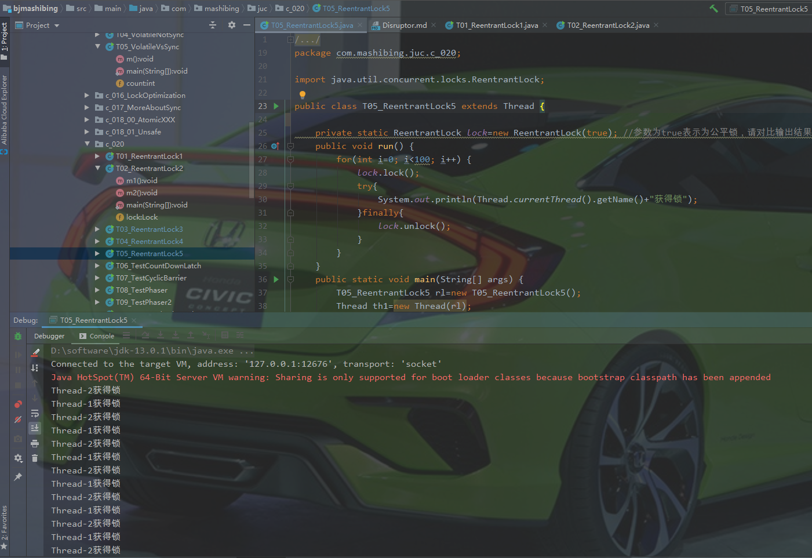
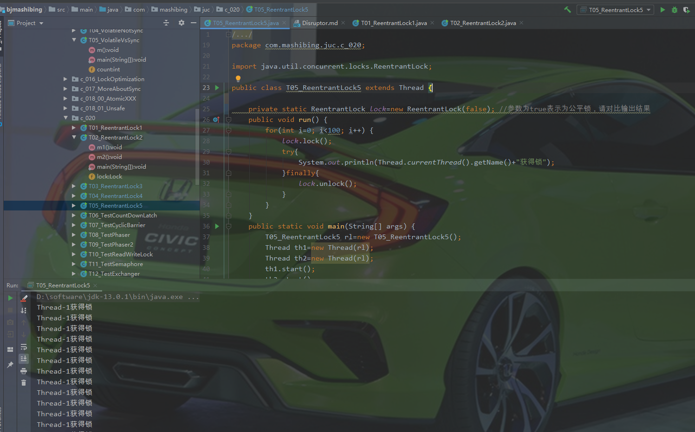
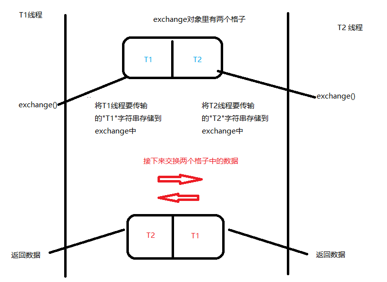
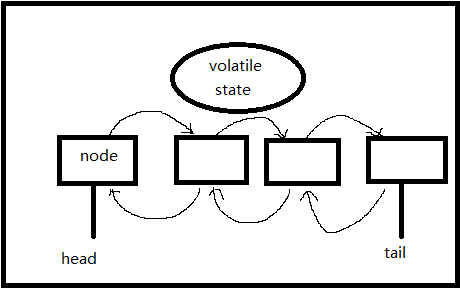
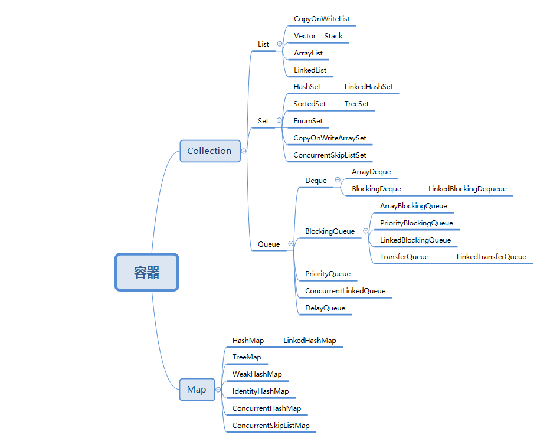
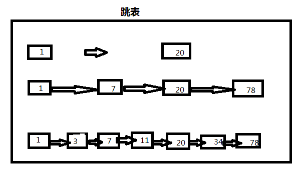

# Table of Contents

* [architect](#architect)
  * [多线程与高并发](#多线程与高并发)
    * [1.基础概念](#1基础概念)
      * [1.1 什么是线程?](#11-什么是线程)
      * [1.2 什么是进程?](#12-什么是进程)
      * [1.3 创建线程的几种方式?](#13-创建线程的几种方式)
      * [1.4 线程的常用方法](#14-线程的常用方法)
      * [1.5 线程的状态](#15-线程的状态)
      * [1.6几道面试题](#16几道面试题)
      * [1.7synchronized关键字](#17synchronized关键字)
    * [2.解析自旋锁CAS操作与volatile](#2解析自旋锁cas操作与volatile)
      * [2.1 volatile作用](#21-volatile作用)
      * [2.2注意点：](#22注意点：)
      * [2.3 锁优化](#23-锁优化)
      * [2.4 CAS关键字](#24-cas关键字)
        * [2.4.1 CAS介绍](#241-cas介绍)
        * [2.4.2 CAS源码](#242-cas源码)
        * [2.4.3 CAS原理](#243-cas原理)
        * [2.4.4 ABA问题](#244-aba问题)
    * [3. Atomic类和线程同步机制](#3-atomic类和线程同步机制)
      * [3.1 常见问题</br>](#31-常见问题br)
      * [3.2 ReentrantLock](#32-reentrantlock)
        * [3.2.1 API使用](#321-api使用)
        * [3.2.2 公平锁与非公平锁](#322-公平锁与非公平锁)
        * [3.2.2 ReentrantLock优点](#322-reentrantlock优点)
      * [3.3 CountDownLatch](#33-countdownlatch)
        * [3.3.1 CountDownLatch是什么](#331-countdownlatch是什么)
        * [3.3.2 CountDownLatch简单使用](#332-countdownlatch简单使用)
        * [3.3.3 CountDownLatch使用场景](#333-countdownlatch使用场景)
      * [3.4 CyclicBarrier](#34-cyclicbarrier)
        * [3.4.1 CyclicBarrier是什么](#341-cyclicbarrier是什么)
        * [3.4.2 CyclicBarrier 使用场景](#342-cyclicbarrier-使用场景)
      * [3.5 Phraser](#35-phraser)
        * [3.5.1 phaser是什么？](#351-phaser是什么？)
        * [3.5.2 phaser使用场景](#352-phaser使用场景)
      * [3.6 ReadWriteLock](#36-readwritelock)
        * [3.6.1 ReadWriteLock 介绍](#361-readwritelock-介绍)
      * [3.7 Semaphore](#37-semaphore)
        * [3.7.1 Semaphore介绍](#371-semaphore介绍)
      * [3.8 Exchanger](#38-exchanger)
      * [3.9 总结](#39-总结)
    * [4 LockSupport、淘宝面试题与源码阅读方法论](#4-locksupport、淘宝面试题与源码阅读方法论)
      * [4.1 LockSupport](#41-locksupport)
      * [4.2 面试题](#42-面试题)
      * [4.3 阅读源码规则](#43-阅读源码规则)
    * [5. AQS源码、ThreadLocal原理与源码以及强软弱虚4种引用](#5-aqs源码、threadlocal原理与源码以及强软弱虚4种引用)
      * [5.1 AQS源码](#51-aqs源码)
      * [5.2 VarHandle](#52-varhandle)
      * [5.3 ThreadLocal](#53-threadlocal)
        * [5.3.1 ThreadLocal使用](#531-threadlocal使用)
        * [5.3.2 ThreadLocal源码](#532-threadlocal源码)
      * [5.4 java强软弱虚4种引用](#54-java强软弱虚4种引用)
        * [5.4.1 強引用](#541-強引用)
        * [5.4.2 软引用](#542-软引用)
        * [5.4.3 弱引用](#543-弱引用)
        * [5.4.4 虚引用](#544-虚引用)
    * [6.并发容器](#6并发容器)
      * [6.1 容器简介](#61-容器简介)
      * [6.2 HashTable](#62-hashtable)
      * [6.3 ConcurrentHashMap](#63-concurrenthashmap)
      * [6.4 Vector到Queue的发展历程](#64-vector到queue的发展历程)
      * [6.5 ConcurrentMap](#65-concurrentmap)
      * [6.6 CopyOnWrite](#66-copyonwrite)
      * [6.7 BlockingQueue](#67-blockingqueue)
      * [6.8 LinkedBlockingQueue](#68-linkedblockingqueue)
      * [6.8 ArrayBlockingQueue](#68-arrayblockingqueue)
      * [6.9 DelayQueue](#69-delayqueue)
      * [6.10 SynchronousQueue](#610-synchronousqueue)
      * [6.11 TransferQueue](#611-transferqueue)


# architect
马士兵java架构师课程的一些笔记整理以及代码(想系统学习，请购买正版)
## 多线程与高并发
### 1.基础概念

#### 1.1 什么是线程?
作为一个进程里面最小的执行单元它就叫一个线程，简单来说一个程序里不同的执行路径就叫做一个线程
#### 1.2 什么是进程?
做一个简单的解释，你的硬盘上有一个简单的程序，这个程序叫QQ.exe,这是一个程序，这个程序是一个静态的概念，它被扔在硬盘上也没人理他，但是当你双击它，弹出一个界面输入账号密码登录进去了，OK，这个时候叫做一个进程。进程相对于程序来说它是一个动态的概念。
#### 1.3 创建线程的几种方式?
第1种：Thread</br>
第2种: Runnable</br>
第3种.Executors.newCachedThrad或者FutureTask+Callable(其实线程池也是使用上面两种方式之一，有点吹毛求疵，可以说线程池或者FutureTask+Callable)
####  1.4 线程的常用方法
**sleep**：sleep意思是睡眠，当前线程暂停一段时间让给别的线程去运行，sleep是怎么复活的?由你的睡眠时间而定，等睡眠到规定的时间自动复活
</br>
**yield**: 就是当前线程正在执行的时候停下来进入等待队列，回到等待队列在系统的调度算法里头还是依然有可能把你刚回去的这个线程拿回来继续执行，当然，更大的可能性是把原来等待的那些拿出一个来执行，所以yield的意思是我让出一下cpu，后面你们能不能抢到我不管
</br>
**join**: 意思就是在你自己当前线程加入你调用的join的线程，本线程等待。等调用的线程运行完了，自己再去执行

#### 1.5 线程的状态
**New**：新创建了一个线程对象，但还没有调用start()方法

**Runnable**： 运行状态又包括ready和running，ready状态是说扔到cpu的等待队列里面去排队等待cpu的运行；running状态是等真正扔到cpu上去运行的时候才叫Running运行状态

**Terminal**：线程顺利执行完了就会进入结束状态

**TimedWaiting**：TimedWaiting按照时间等待，等时间结束自己就回去了，Thread.sleep(time)、o.wait(time)、t.join(time)、LockSupport.parkNanos()、LockSupport.parkUntil()这些都是关于时间等待的方法

**Waiting**：在运行的时候如果调用了o.wait(), t.join(),LockSupport.park()进入waiting状态

**Blocked**：在同步代码块的情况下没得到锁就会进入阻塞状态，获得锁的时候就是就绪状态运行。在运行的时候如果调用了o.wait(), t.join(),LockSupport.park()进入waiting状态，o.notify、o.notifyAll、LockSupport.unpark又会回到running状态

#### 1.6几道面试题
1.线程的状态哪些是JVM管理的，哪些是操作系统管理的?
	上面这些状态全是由JVM管理的，因为JVM管理的时候也要通过操作系统，所以呢，哪个是操作系统哪个是JVM他俩分不开，JVM是跑在操作系统上的一个普通程序

2.线程什么状态时候会被挂起？挂起是否也是一个状态？
	Running的时候，在一个cpu上会跑很多线程，cpu隔一段时间执行这个线程一下，再隔一段时间执行那个线程一下，这是cpu的一个调度，把这个线程状态扔出去，从running状态扔回去就叫线程被挂起，cpu控制它(即线程状态从running变为ready状态称为线程挂起)

3.T.class是单例的吗？
	如果是同一个classLoader空间那它一定是。不是同一个类加载器就不是了，不同的类加载器互相之间也是不能访问的，所以说你能访问它，那他一定就是单例

4.synchronized既然能保证有序性，为什么还需要用volatile防止指令重排?
	synchronized只保证了代码的有序性，但是变量的赋值操作依旧可以被编译器优化，此时会发生指令重排序;而volatile就是为了防止编译器指令重排序的。
	哪些情况不会出现代码重排序：满足happens-before或者as-if-serial，则不会出现代码重排序，参考链接，S.x的文章https://franksong.blog.csdn.net/article/details/99190310	

#### 1.7synchronized关键字
**异常锁**: 程序在执行过程中，如果出现异常，默认情况锁会被释放。所以，在并发过程中，有异常要多加小心，不然可能会发生不一致的情况。比如，在一个web app处理过程中，多个servlet线程共同访问同一个资源，这时如果异常处理不合适，在第一个线程中抛出异常，其他线程就会进入同步代码区，有可能会访问到异常产生的数据，因此要非常小心的处理同步业务逻辑中的异常

**synchronized特性**

1.原子性: 原子性就是在执行一个或者多个操作的过程中，要么全部执行完不被任何因素打断，要么不执行

2.可见性:当多个线程访问同一个变量时，一个线程修改了变量的值，其他的线程能立即看到，这就是可见性

3.可重入：如果是一个同步方法调用另一个同步方法，有一个方法加了锁，另一个方法也需要加锁，加的是同一把锁也是同一个线程，那这个时候申请仍然也会得到该对象的锁。

4.有序性：就是程序的执行顺序会按照代码先后顺序进行执行，一般情况下，处理器由于要提高执行效率，对代码进行重排序，运行的顺序可能和代码先后顺序不同，但是结果一样。单线程下不会出现问题，多线程就会出现问题了。

**锁升级**
偏向锁->自旋锁->重量级锁 


偏向锁：第一个去访问某把锁的线程，比如sync(object),来了之后先在这个Object的头上面的markWord记录这个线程。(如果只有第一个线程访问的时候实际上是没有给这个Object加锁的， 在内部实现的时候，只是记录这个线程的ID)，这就叫偏向锁，上图展示了64位JVM中markdown的存储结构

自旋锁：偏向锁如果有线程争用的话，就升级为自旋锁，概念就是(有一个哥们在厕所蹲马桶，另外来了一个哥们，他就在旁边等着，他不会跑到cpu的就绪队列里去，而就在这等着占用cpu，用一个while循环在这儿转圈玩儿，很多圈之后不行的话就再一次进行升级)。

重量级锁：自旋锁转圈十次以后，升级为重量级锁，重量级锁就是去操作系统那里去申请资源。从偏向锁-->自旋锁-->重量级锁这是一个锁升级的过程。

**锁的选择**</br>
什么时候用自旋锁?</br>
加锁代码执行时间短，线程数少，用自旋。</br>

什么时候用系统锁？</br>
执行时间长，线程数多，用系统锁</br>

### 2.解析自旋锁CAS操作与volatile
#### 2.1 volatile作用
 **保证线程可见性**：
 	java里面是有堆内存的，堆内存是所有线程共享里面的内存，除了共享的内存之外呢，每个线程都有自己的专属的区域，都有自己的工作内存，如果说在共享内存里有一个值的话，当我们线程，某一个线程都要去访问这个值得时候，会将这个值copy一份，copy到自己的工作空间里头，然后对这个值的改变，首先都是在自己的空间里进行改变，什么时候写回去，就是改完之后马上写回去。什么时候去检查有没有新的值，也不好控制。在这个线程发生的改变，没有及时的反应到另外一个线程里面，这就是线程之间的不可见。Volatile可以保证一个线程的改变另一个线程能立马看到。volatile本质上是使用了CPU缓存一致性协议MESI来保证可见。

 **禁止指令重排序**：
	指令重排序也是和cpu有关系，每次写都会被线程读到，加入了volatile之后。cpu原来执行一条指令的时候，它是一步一步按顺序执行，但是现在的cpu为了提高效率，它会把指令并发的来执行，第一个指令执行到一半的时候第二个指令可能就已经开始执行了，这叫做流水线式的执行。在这种新的架构的设计基础之上呢想充分利用这一点，那么就要求你的编译器把你的源码编译完的指令之后呢可能进行一个指令的重新排序。通过实际工程验证了，效率提高了好多
#### 2.2注意点：
 2.2.1 count++不属于原子操作，如果只加volatile，只能保证可见性，保证不了可见性。所以还需要加上synchronized</br>
 2.2.2 如果锁对象，请将该对象设置为final,防止锁对象被改变，导致锁失效</br>
 #### 2.3 锁优化
 **锁细化**：</br>
 	如果在一个方法中，只需要对其中的一小部分代码进行上锁，那么不要把锁写在睁开方法上，提升性能</br>
 **锁粗化**:</br>
 	如果一个方法里面有很多小锁，锁的对象都一样，那还不如弄成一把大锁，这样减少锁和解锁的次数，提升性能</br>
 #### 2.4 CAS关键字
 ##### 2.4.1 CAS介绍
 CAS号称无锁优化，或者叫自旋。名字无所谓，主要得理解它的意思。在jdk中，以Atomic开头的类都是以CAS这种操作来保证线程安全的。AtomicInteger的意思就是里面包了一个int类型，这个int类型的自增count++是线程安全的，还有拿值也是线程安全的，由于我们在工作中经常遇到一个值所有线程共同访问它往上递增，所以，jdk专门提供了这样一些类

 ##### 2.4.2 CAS源码
 让我们来通过AtomicInteger来了解CAS，

AtomicInteger类源码(JDK11的源码) 


Unsafe类源码(JDK11的源码)


##### 2.4.3 CAS原理
可以在unsafe类中看到weakCompareAndSetInt方法中调用了compareAndSetInfo方法，CAS全称是compare and swap（比较和交换），在java代码中是compareAndSet，java代码实际上调用的是底层C++代码，C++代码的方法名是compareAndSwap,该方法有4个参数，第1个参数就是你要设置值的对象，第2个参数表示该字段在该类在内存的偏移量，第3个参数是期望当前值会是几，第4个参数是你要设置的新值。比如我期望你的值是0，你不能是1，否则我就认为在我这个线程修改的过程中值已经被其他线程修改过了，如果出现这种情况，我就再循环一次，重新获取新的值，在新值的基础上加1，直到设置成功为止。

##### 2.4.4 ABA问题
**问题描述**</br>
这个ABA问题是这样的，假如说你有一个值，我拿到这个值是1，想把它变成2，但是在变成2之前，有另一个线程已经把改值变为2再变成1了，这就是ABA问题</br>

**解决方案**</br>
第1种情况：如果是基础类型，无所谓，不会影响结果值</br>
第2种情况：如果是引用类型，加上版本号字段，每修改一次版本号加1，在检查的时候期望值和版本号一起检查</br>

### 3. Atomic类和线程同步机制
#### 3.1 常见问题</br>
为什么Atomic要比sync快?</br>
因为Atomic不加锁,synchronized是要加锁的，有可能去操作系统申请重量级锁，所以sync效率偏低</br>

LongAdder为什么要比Atomic效率要高呢?</br>
因为LongAdder内部做了一个分段锁，在内部的时候，会把一个值放到一个数组里，比如说数组长度是4，最开始是0，1000个线程，250个线程锁在第一个数组元素里，以此类推，每一个都往上递增算出来的结果再加到一起。个人理解就是sync是一个锁，多个线程竞争同一把锁，而LongAdder是多个锁，锁的个数就是LongAdder内部数组长度，比如数组长度为4时，有4个锁，线程获取到锁的几率就会大一点，等待时间少一点，所以效率高</br>

#### 3.2 ReentrantLock

##### 3.2.1 API使用

lock.lock()、lock.unlock() API使用

使用lock和unlock来代替synchronized.不同的是synchronized自动释放锁，lock必须手动释放锁，
并且手动解锁一定要写在try...finally里面保证最好一定要解锁，不然的话锁上之后中间执行过程有问题就死在那了，别人永远也拿不到这把锁了

```java
public class T01_ReentrantLock1 {
	void m1() {
		try {
			lock.lock(); //synchronized(this)
			for (int i = 0; i < 10; i++) {
				TimeUnit.SECONDS.sleep(1);

				System.out.println(i);
			}
		} catch (InterruptedException e) {
			e.printStackTrace();
		} finally {
			lock.unlock();
		}
	}
}
```


tryLock()、tryLock(long timeout, TimeUnit unit) API使用

使用tryLock进行尝试锁定，不管锁定与否，方法都将继续执行可以根据tryLock的返回值来判定是否锁定也可以指定tryLock的时间，
由于tryLock(time)抛出异常，所以要注意unclock的处理，必须放到finally中。如果使用tryLock()没有获得锁，代码会立即向下执行，不会等待

lock.lockInterruptibly()与lock.lock()区别

lock 优先考虑获取锁，待获取锁成功后，才响应中断。
lockInterruptibly 优先考虑响应中断，而不是响应锁的普通获取或重入获取

##### 3.2.2 公平锁与非公平锁

ReentrantLock 默认是非公平的，如图3-2-1-1,公平锁的情况线程1和线程2是交替打印的，而图3-2-1-2，非公平锁的则是一个线程执行完再执行另一个线程的



​								

<center>图3-2-1-1 公平锁代码</center>			



<center>图3-2-1-2非公平锁代码</center>

##### 3.2.2 ReentrantLock优点

1.可以替代synchronized

2.tryLock：自己来控制，锁不住的时候怎么办

3.lockInterruptibly可以控制被打断

4.可以指定公平与非公平锁

#### 3.3 CountDownLatch

##### 3.3.1 CountDownLatch是什么

是一个同步工具类，它允许一个或多个线程一直等待，直到其他线程的操作执行完后再执行
通俗的讲CountDown叫倒数，latch叫门栓(倒数的一个门栓，5、4、3、2、1数到了，我这个门栓就开了)

##### 3.3.2 CountDownLatch简单使用

初始化计数为5的门栓，当调用5次countDownLatch.countDown()方法时，门栓将被打开

指定了计数的次数<br>
CountDownLatch countDownLatch = new CountDownLatch(5);

countDownLatch.countDown()
将门栓计数减1

countDownLatch.await()

调用该方法的线程等到构造方法传入的 N 减到 0 的时候，才能继续往下执行；

##### 3.3.3 CountDownLatch使用场景

举例：在某些业务情况下，要求我们等某个条件或者任务完成后才可以继续处理后续任务。
同时在线程完成时也会触发一定事件。方便业务继续向下执行
```java
public class T06_TestCountDownLatch {
    public static void main(String[] args) {
//        usingJoin();
        usingCountDownLatch();
    }
    private static void usingCountDownLatch() {
        Thread[] threads = new Thread[100];
        CountDownLatch latch = new CountDownLatch(threads.length);

        for(int i=0; i<threads.length; i++) {
            threads[i] = new Thread(() -> {
                int result = 0;
                for (int j = 0; j < 10000; j++)
                    result += j;
                latch.countDown();
            });
        }

        for (int i = 0; i < threads.length; i++) {
            threads[i].start();
        }

        try {
            latch.await();
        } catch (InterruptedException e) {
            e.printStackTrace();
        }

        System.out.println("end latch");
    }
}
```

#### 3.4 CyclicBarrier

##### 3.4.1 CyclicBarrier是什么

CyclicBarrier意思是循环栅栏，大概意思是一个可循环利用的屏障。
这有一个栅栏，什么时候人满了就把栅栏推到。把人放出去，出去之后栅栏又重新起来，再来人，满了，推到之后又继续
[CyclicBarrier 使用详解](https://www.jianshu.com/p/333fd8faa56e) 

##### 3.4.2 CyclicBarrier 使用场景

举例：比如某个接口需要访问网络、需要访问数据库、需要访问文件，
如果每一个操作都需要10秒，顺序执行的话至少需要30秒，
如果并发执行，分别使用不同的线程去访问网络、数据库、文件，等待3个线程全部到位了，再进行后面的操作，这个时候我们可以用CyclicBarrier
```java
package com.kiwi.field.architect.chap3;

import java.util.concurrent.BrokenBarrierException;
import java.util.concurrent.CyclicBarrier;

public class TestCyclicBarrier {
    public static void main(String[] args) {
        //CyclicBarrier barrier = new CyclicBarrier(20);

        CyclicBarrier barrier = new CyclicBarrier(20, () -> System.out.println("满人"));

        /*CyclicBarrier barrier = new CyclicBarrier(20, new Runnable() {
            @Override
            public void run() {
                System.out.println("满人，发车");
            }
        });*/

        for(int i=0; i<100; i++) {

                new Thread(()->{
                    try {
                        barrier.await();

                    } catch (InterruptedException e) {
                        e.printStackTrace();
                    } catch (BrokenBarrierException e) {
                        e.printStackTrace();
                    }
                }).start();
            
        }
    }
}

```
#### 3.5 Phraser

##### 3.5.1 phaser是什么？

phaser翻译成中文叫阶段，它像是结合了countDownLatch和CyclicBarrier，这个稍微复杂一些
想简单使用phaser，参考代码chap3 下 TestPhaser类 

也可以参考下面这篇文章
[What's New on Java 7 Phaser](https://www.iteye.com/blog/whitesock-1135457)

##### 3.5.2 phaser使用场景

phaser按照不同的阶段来对线程进行执行，本身是维护着一个阶段这样的一个成员变量，当前我执行到哪个阶段，第0个还是第1
个阶段等等，每个阶段不同，这个线程可以继续往前走，有的线程走到某个阶段就停了，有的线程会一直走到结束。你的程序中如果需要分好几个阶段执行，而且有的阶段必须得
必须得几个人共同参与的一种情形可能会用到phaser
```java
package com.kiwi.field.architect.chap3;

import java.util.Random;
import java.util.concurrent.Phaser;
import java.util.concurrent.TimeUnit;

/**
 * 模拟一个结婚场景，结婚是有好多人要参加的，因此我们写了一个Person，实现了runnable接口，模拟我们每个人要做一些操作，有
 * 几种方法，arrive()到达，eat()吃、leave() 离开、hug()拥抱这么几个。作为一个婚礼来说它会分成好几个阶段，
 * 第1阶段所有人都到齐了
 * 第2阶段所有人都吃饭
 * 第3阶段所有人都离开
 * 第4阶段新郎新娘入洞房
 * 在上述4个阶段中1、2、3阶段需要所有人都到齐，而第4个阶段洞房的事除了新郎新娘，其他人可不能干了
 * 以下程序将整个过程分为好几个阶段，而且每个阶段必须要等这些线程给我干完事儿你才能进入下一个阶段
 */
public class TestPhaser {
    static Random r = new Random();
    static MarriagePhaser phaser = new MarriagePhaser();


    static void milliSleep(int milli) {
        try {
            TimeUnit.MILLISECONDS.sleep(milli);
        } catch (InterruptedException e) {
            e.printStackTrace();
        }
    }

    public static void main(String[] args) {

        // 指定初始数量为7
        phaser.bulkRegister(7);

        // 启动5个普通客人线程
        for(int i=0; i<5; i++) {

            new Thread(new Person("p" + i)).start();
        }

        // 启动新郎新娘2个线程
        new Thread(new Person("新郎")).start();
        new Thread(new Person("新娘")).start();

    }


    static class MarriagePhaser extends Phaser {

        @Override
        protected boolean onAdvance(int phase, int registeredParties) {
            //如果该方法返回true，那么Phaser会被终止。
            switch (phase) {
                case 0:
                    System.out.println("所有人到齐了！" + registeredParties);
                    System.out.println();
                    return false;
                case 1:
                    System.out.println("所有人吃完了！" + registeredParties);
                    System.out.println();
                    return false;
                case 2:
                    System.out.println("所有人离开了！" + registeredParties);
                    System.out.println();
                    return false;
                case 3:
                    System.out.println("婚礼结束！新郎新娘抱抱！" + registeredParties);
                    return true;
                default:
                    return true;
            }
        }
    }


    static class Person implements Runnable {
        String name;

        public Person(String name) {
            this.name = name;
        }

        public void arrive() {

            milliSleep(r.nextInt(1000));
            System.out.printf("%s 到达现场！\n", name);
            phaser.arriveAndAwaitAdvance();
        }

        public void eat() {
            milliSleep(r.nextInt(1000));
            System.out.printf("%s 吃完!\n", name);
            // 线程到达arriveAndAwaitAdvance方法时会等待前进
            phaser.arriveAndAwaitAdvance();
        }

        public void leave() {
            milliSleep(r.nextInt(1000));
            System.out.printf("%s 离开！\n", name);


            phaser.arriveAndAwaitAdvance();
        }

        private void hug() {
            if(name.equals("新郎") || name.equals("新娘")) {
                milliSleep(r.nextInt(1000));
                System.out.printf("%s 洞房！\n", name);
                phaser.arriveAndAwaitAdvance();
            } else {
                // 使当前线程退出，并且是parties值减1
                phaser.arriveAndDeregister();
                //phaser.register()
            }
        }

        @Override
        public void run() {
            arrive();


            eat();


            leave();


            hug();

        }
    }
}
```
#### 3.6 ReadWriteLock

##### 3.6.1 ReadWriteLock 介绍

这个ReadWriteLock是读写锁，读写锁的概念其实就是共享锁和排他锁，读锁就是共享锁，写锁就是排他锁。
那这个是什么意思呢，我们先要来理解这件事，读写有很多种情况，比如说你数据库里的某条数据你放在内存里读的时候特别多，而改的时候并不多。

举一个简单的例子：某公司的组织结构，需要在网页上显示，但是写操作却非常少，除非有人进来或者出去，这时候如果有很多个线程进来，
有的是读线程有的是写线程，要求不它不会产生数据不一致的情况我们会采用最简单的方式就是加锁，每次只能一个人读或者一个人写，但是这样的效率特别低。
尤其是读多写少的时候，此时我们可以使用ReadWriteLock
，当读线程来的时候加一把锁是允许其他读线程可以读，写线程来了我不给它，你先别写等我读完你再写。读进程进来的时候大家一块读，因为你不改原来的内容，写线程上来把整个线程全锁定，你先不要读，等我写完你再读

简单来说就是读读共享、读写互斥、写读也是互斥，参考代码chap3 下 TestReadWriteLock类 

```java
package com.kiwi.field.architect.chap3;

import java.util.Random;
import java.util.concurrent.locks.Lock;
import java.util.concurrent.locks.ReadWriteLock;
import java.util.concurrent.locks.ReentrantLock;
import java.util.concurrent.locks.ReentrantReadWriteLock;

public class TestReadWriteLock {
    static Lock lock = new ReentrantLock();
    private static int value;

    static ReadWriteLock readWriteLock = new ReentrantReadWriteLock();
    static Lock readLock = readWriteLock.readLock();
    static Lock writeLock = readWriteLock.writeLock();

    public static void read(Lock lock) {
        try {
            lock.lock();
            Thread.sleep(1000);
            System.out.println("read over!");
            //模拟读取操作
        } catch (InterruptedException e) {
            e.printStackTrace();
        } finally {
            lock.unlock();
        }
    }

    public static void write(Lock lock, int v) {
        try {
            lock.lock();
            Thread.sleep(1000);
            value = v;
            System.out.println("write over!");
            //模拟写操作
        } catch (InterruptedException e) {
            e.printStackTrace();
        } finally {
            lock.unlock();
        }
    }


    public static void main(String[] args) {
        //Runnable readR = ()-> read(lock);
        Runnable readR = ()-> read(readLock);

        //Runnable writeR = ()->write(lock, new Random().nextInt());
        Runnable writeR = ()->write(writeLock, new Random().nextInt());

        for(int i=0; i<18; i++) new Thread(readR).start();
        for(int i=0; i<2; i++) new Thread(writeR).start();


    }
}
```
#### 3.7 Semaphore

##### 3.7.1 Semaphore介绍

Semaphore中文意思是信号灯，可以往里面传一个参数，permits是允许的数量，你可以想着有几盏信号灯，一个灯里面闪着数字表示到底允许几个来参考我这个信号灯。
s.acquire()这个方法是阻塞方法，阻塞方法的意思是说我acquire不到我就停在这，acquire的意思就是得到。如果我
Semaphore s = new Semaphore(1);写的是1，我取一下acquire一下，他就变成0，变成0之后别人是acquire不到的，然后继续执行，线程结束之后注意要s.release
(),执行完该执行的就把他release掉，release又把0变成1。

Semaphore的含义是限流，比如说你在买车票，Semaphore写5就是只能有5个人同时买票。acquire的意思是获得这把锁。
线程如果想继续往下执行，必须从semaphore里面获得一个许可，他一个有5个许可到0了你就得给我等着。

例如，有一个八条车道的机动车道，这里只有两个收费站，到这儿，谁acquire得到其中某一个谁执行。默认Semaphore是非
公平的,new Semaphore(2, true)第2个值传true才是设置公平，公平这个事儿是有一堆队列在那儿等，大家伙过来排队。用这个车道
和收费站来举例子，就是我们有四辆车都在等着进一个车道，当后面来一辆新的时候，它不会超到前面去，要在后面排队这叫公平。所以说内部是有队列的，不仅内部有队列，
ReentrantLock、CountDownLatch、CyclicBarrier、Phaser、ReadWriteLock、Semaphore还有后面的exchanger都是用的同一个队列，同一个类实现的，这个类叫AQS

```java
package com.kiwi.field.architect.chap3;

import java.util.concurrent.Semaphore;

/**
 * 如果Semaphore 设置为1,则会等到一个线程都执行完，才能执行另一个线程
 * 如果Semaphore 设置为2，两个线程会同时执行，会出现交替输出的情况
 * new Semaphore(2, true) 第2个参数为true表示是公平，默认Semaphore是非公平的
 */
public class TestSemaphore {
    public static void main(String[] args) {
        //Semaphore s = new Semaphore(2);
//        Semaphore s = new Semaphore(2, true);
        //允许一个线程同时执行
        Semaphore s = new Semaphore(1);

        new Thread(()->{
            try {
                s.acquire();

                System.out.println("T1 running...");
                Thread.sleep(200);
                System.out.println("T1 running...");

            } catch (InterruptedException e) {
                e.printStackTrace();
            } finally {
                s.release();
            }
        }).start();

        new Thread(()->{
            try {
                s.acquire();

                System.out.println("T2 running...");
                Thread.sleep(200);
                System.out.println("T2 running...");

                s.release();
            } catch (InterruptedException e) {
                e.printStackTrace();
            }
        }).start();
    }
}
```

#### 3.8 Exchanger

Exanger叫做交换器，两人之间互相交换数据用的。怎么交换呢，看如下代码,T1和T2都有一个成员变量s，
第1个线程执行到exchanger.exchange位置的时候会阻塞，当第2个线程执行到这的时候，会交换两个线程的数据，
执行下列代码你会发现t1线程打印的是T2, t2线程打印的是T1
```java
package com.kiwi.field.architect.chap3;

import java.util.concurrent.Exchanger;

public class TestExchanger {

    static Exchanger<String> exchanger = new Exchanger<>();

    public static void main(String[] args) {
        new Thread(()->{
            String s = "T1";
            try {
                s = exchanger.exchange(s);
            } catch (InterruptedException e) {
                e.printStackTrace();
            }
            System.out.println(Thread.currentThread().getName() + " " + s);

        }, "t1").start();

        new Thread(()->{
            String s = "T2";
            try {
                s = exchanger.exchange(s);
            } catch (InterruptedException e) {
                e.printStackTrace();
            }
            System.out.println(Thread.currentThread().getName() + " " + s);

        }, "t2").start();
    }
}

```
这段代码的执行过程如下图


#### 3.9 总结
ReentrantLock比synchronized更灵活、更方便

CountDownLatch的用法，就是倒计时，什么时候计数完了，门栓打开，程序继续往下执行

CycliBarrier一个栅栏，循环使用，什么时候人满了，栅栏放倒大家冲过去;

Phaser 分阶段的栅栏

ReadWriteLock 读写锁

Semaphore 限流用

Exchange两个线程之间互相交换数据

### 4 LockSupport、淘宝面试题与源码阅读方法论

#### 4.1 LockSupport

在以前我们要阻塞和唤醒某一个具体的线程有很多限制比如：

1. 因为wait()方法需要释放锁，所以也必须在synchronized中使用，否则会跑出异常IllegalMonitorStateException

2.notify()方法也必须在synchronized中使用，并且应该指定对象

3.synchronized、wait()、notify()对象必须一致，一个synchronized()代码块中只能有一个线程调用wait()或notify()

以上诸多限制，体现出了很多不足，所以LockSupport的好处就体现出来了。
在JDK1.6中的java.util.concurrent的子包locks中引入了LockSupport这个API，LockSupport是一个比较底层的工具类，
用来创建锁和其他同步工具类的基本线程阻塞原语。java锁和同步器框架的核心AQS:AbstractQueuedSynchronizer,
就是通过调用LockSupport.park()和LockSupport.unpark()的方法，来实现线程的阻塞和唤醒的。来看一段小程序：

```java
package com.kiwi.field.architect.chap4;

import java.util.concurrent.TimeUnit;
import java.util.concurrent.locks.LockSupport;

public class TestLockSupport {
    public static void main(String[] args) {
        Thread t = new Thread(()->{
            for (int i = 0; i < 10; i++) {
                System.out.println(i);
                if(i == 5) {
                    // 使用LockSupport的park()方法阻塞当前线程t
                    LockSupport.park();
                }
                try {
                    TimeUnit.SECONDS.sleep(1);
                } catch (InterruptedException e) {
                    e.printStackTrace();
                }
            }
        });

        t.start();
    }
}

```

从以上程序可以看出，线程t循环10次，每次睡1秒，当i=5的时候，我们调用了LockSupport的park方法
使当前线程阻塞，此时方法并没有加锁，就默认使当前线程阻塞了，由此可以看出LockSupport.park()方法并没有加锁的限制。

我们再来看一段小程序：
```java
package com.kiwi.field.architect.chap4;

import java.util.concurrent.TimeUnit;
import java.util.concurrent.locks.LockSupport;

public class TestLockSupport {
    public static void main(String[] args) {
        Thread t = new Thread(()->{
            for (int i = 0; i < 10; i++) {
                System.out.println(i);
                if(i == 5) {
                    // 使用LockSupport的park()方法阻塞当前线程t
                    LockSupport.park();
                }
                try {
                    TimeUnit.SECONDS.sleep(1);
                } catch (InterruptedException e) {
                    e.printStackTrace();
                }
            }
        });

        t.start();


        try {
            TimeUnit.SECONDS.sleep(8);
        } catch (InterruptedException e) {
            e.printStackTrace();
        }
        System.out.println("after 8 senconds!");
        LockSupport.unpark(t);

    }
}

```
分析上面的程序，我们只需要在第一个小程序的主线程中，调用LockSupport的unpark()方法，就可以唤醒某个具体的线程，
这里我们指定了线程"t",代码运行以后结果显而易见，线程并没有被阻塞，我们成功唤醒了线程"t",在这里还有一点，我们需要分析一下，
在主线程中线程"t"调用了start()方法以后，因为紧接着执行了LockSupport的unpark()方法，所以也就是说，在线程"t"
还没有执行还没有阻塞的时候，已经调用了LockSupport的unpark方法来唤醒线程"t",之后线程"t"才调用了LockSupport的park()来使
线程"t"阻塞，但是线程"t"并没有被阻塞，由此可以看出，LockSupport的unpark方法可以优先于LockSupport的park方法执行。

我们再来看最后一个小程序：
```java
package com.kiwi.field.architect.chap4;

import java.util.concurrent.TimeUnit;
import java.util.concurrent.locks.LockSupport;

public class TestLockSupport {
    public static void main(String[] args) {
        Thread t = new Thread(()->{
            for (int i = 0; i < 10; i++) {
                System.out.println(i);
                if(i == 5) {
                    // 使用LockSupport的park()方法阻塞当前线程t
                    LockSupport.park();
                }

                if (i==8) {
                    // 使用LockSupport的park()方法阻塞当前线程t
                    LockSupport.park();
                }
                try {
                    TimeUnit.SECONDS.sleep(1);
                } catch (InterruptedException e) {
                    e.printStackTrace();
                }
            }
        });

        t.start();


//        LockSupport.unpark(t);

        try {
            TimeUnit.SECONDS.sleep(8);
        } catch (InterruptedException e) {
            e.printStackTrace();
        }
        System.out.println("after 8 senconds!");

        LockSupport.unpark(t);

    }
}

```
在第二个小程序的基础上又增加了if (i==8)的判断，在i==8的时候再次调用LockSupport的方法使线程"t"阻塞，我们可以看到线程被阻塞了
原因是LockSupport.unpark()方法就像是帮线程获得一块令牌，而LockSupport.park()方法就像是识别令牌，
当主线程调用了LockSupport.unpark(t)相当于线程t获得了一块令牌，当线程t第一次调用LockSupport.park()时，线程t已经有令牌了，
所以不会阻塞，但是第二次调用LockSupport.park()时，线程t已经没有令牌可以使用了，就会一直阻塞下去

由以上3个小程序我们可以总结得出以下几点：

1.LockSupport不需要synchorized加锁就可以实现线程的阻塞和唤醒

2.LockSupport.unpark()可以优先于LockSupport.park()执行，并且线程不会阻塞

3.如果一个线程处于等待状态，连续调用了两次park()方法，就会使该线程无法被唤醒

LockSupport中park()和unpark方法实现原理

park()和unpark方法的实现是由unsafe类提供的，而unsafe类是由c和c++语言完成的，其实原理也是比较好理解的，
它主要通过一个变量作为标识，变量值在0和1之间来回切换，当这个变量大于0的时候线程就获得了令牌，从这一点我们不难知道，其实unpark()和park()方法就是在
改变这个变量的值，来达到线程的阻塞和唤醒的，具体不再赘述。

#### 4.2 面试题
见chap4包

#### 4.3 阅读源码规则
1. 跑不起来的源码不读

跑不起来的不要读，看也看不懂，很难看懂，事倍功半，读起来还费劲，什么时候这个源码必须跑起来，跑起来可以debug跟进去，
如果跑不起来的话，看见一个方法有很多个子类实现，你根本不知道跟哪一个

2. 解决问题就好- 目的性

在实际中解决问题就好，读源码一方面可以解决问题，一方面可以应对面试，如果你接手一个别人改过6手的代码，现在老板说代码有些问题，你可以修改一下代码，解决问题就行，不要从头到尾去读去改这个代码，不然会累死你，目的性要强，解决问题就好。

3. 一条线索到底

读源码的时候要一条线索到底，不要只读表面，我们知道一个程序跑起来以后，可能这个程序非常大，一个main方法有很多的put、get、size各种各样其他的方法，每一个方法你调进去，这个方法可能又去调别的方法，不要每个方法先看一遍表面，然后又去里面找，要一条线索到底，就读一个方法，由浅到深再看一遍

4. 无关细节略过

有那些边界性的东西，在你读第一遍的时候，没有必要的时候，你可以先把它略过

### 5. AQS源码、ThreadLocal原理与源码以及强软弱虚4种引用

#### 5.1 AQS源码



我们来根据ReentrantLock来解读一下AQS源码，根据以下代码来debug跟踪源码
```java
import java.util.concurrent.locks.ReentrantLock;

public class TestReentrantLock {

    private static volatile int i = 0;

    public static void main(String[] args) {
        ReentrantLock lock = new ReentrantLock();
        lock.lock();
        i++;
        lock.unlock();
    }
}
```
首先在lock.lock()这一行打上断点，然后debug程序，在lock方法里面，我们可以读到它调用了sync.acquire(1),
源码如下
```java
public class ReentrantLock implements Lock, java.io.Serializable {
    public void lock() {
        sync.acquire(1);
    }
}
```
再跟进到acquire(1)里，可以看到acquire(1)里又调用了AQS里的方法，代码如下:
```java
public abstract class AbstractQueuedSynchronizer
    extends AbstractOwnableSynchronizer
    implements java.io.Serializable {
    public final void acquire(int arg) {
        if (!tryAcquire(arg) &&
            acquireQueued(addWaiter(Node.EXCLUSIVE), arg))
            selfInterrupt();
    }
}
```
跟进到tryAcquire(arg)里又调用了NonfairSync的tryAcquire方法，代码如下
```java
public class ReentrantLock implements Lock, java.io.Serializable {
    static final class NonfairSync extends Sync {
        private static final long serialVersionUID = 7316153563782823691L;
        protected final boolean tryAcquire(int acquires) {
            return nonfairTryAcquire(acquires);
        }
    }
}
```
跟进到tryAcquire里又调用了nonfairTryAcquire(acquires)
```java
abstract static class Sync extends AbstractQueuedSynchronizer {
        final boolean nonfairTryAcquire(int acquires) {
            // 获取当前线程
            final Thread current = Thread.currentThread();
            // 拿到AQS核心数值state
            int c = getState();
            if (c == 0) {
                // 给当前线程上锁
                if (compareAndSetState(0, acquires)) {
                    // 设置当前线程为独一无二拥有这把锁的线程
                    setExclusiveOwnerThread(current);
                    return true;
                }
            }
            // 判断当前线程是否拥有这把锁
            else if (current == getExclusiveOwnerThread()) {
                int nextc = c + acquires;
                if (nextc < 0) // overflow
                    throw new Error("Maximum lock count exceeded");
                setState(nextc);
                return true;
            }
            return false;
        }
}
```
我们跟进到tryAcquire(arg)是拿到了这把锁以后的操作，如果拿不到呢？
如果拿不到它实际上是调用了acquireQueued()方法,acquireQueued()方法就是说没有获得锁的情况下跑到队列里排队去，
排队的时候需要传递两个参数,第一个参数是某个方法的返回值addWaiter(Node.EXCLUSIVE),来看看这个方法的名字addWaiter,waiter等待者， addWaiter添加一个等待者
，用什么样的方式呢？Node.EXCLUSIVE排他形式，意思就是把当前线程作为排他形式扔到队列里边
```java
public abstract class AbstractQueuedSynchronizer
    extends AbstractOwnableSynchronizer
    implements java.io.Serializable {
    public final void acquire(int arg) {
        if (!tryAcquire(arg) &&
            acquireQueued(addWaiter(Node.EXCLUSIVE), arg))
            selfInterrupt();
    }
}
```
再来看一下addWaiter方法,这个方法的意思就是说你添加等待者的时候，使用的是什么类型，如果这个线程是
Node.EXCLUSIVE就是排他锁，Node.SHARED就是共享锁，首先是获得当前要加进等待队列的线程的节点，然后是一个死循环
```java
public abstract class AbstractQueuedSynchronizer
    extends AbstractOwnableSynchronizer
    implements java.io.Serializable {
    public final void acquire(int arg) {
        // 判断是否得到锁 
        if (!tryAcquire(arg) &&
            acquireQueued(addWaiter(Node.EXCLUSIVE), arg))
            selfInterrupt();
    }

    private Node addWaiter(Node mode) {
        // 获取当前要加进来的线程的node节点
        Node node = new Node(mode);
        for (;;) {
            // 这里可以看下上面的AQS数据结构图来理解
            Node oldTail = tail;
            if (oldTail != null) {
                node.setPrevRelaxed(oldTail);
                // CAS操作，把我们这个新节点设置为tail末端
                if (compareAndSetTail(oldTail, node)) {
                    oldTail.next = node;
                    return node;
                }
            } else {
                initializeSyncQueue();
            }
        }
    }
}
```
上面这段代码最重要的就是if (oldTail != null)括号里的这一块了，首先将末端节点赋值给一个oldTail对象，
再将当前要添加节点的前置节点设置为之前的末端节点，然后利用CAS操作compareAndSetTail(oldTail, node)
方法，来将某一个节点添加到最后

**通过AQS是如何设置链表尾巴的来理解AQS为啥效率这么高**

假如你要往一个链表上添加尾巴，尤其是好多线程都要往链表上加上尾巴，普通的方法可能会在这个链表上加个锁，
但是这样的话，锁的太多太大了，现在AQS的实现并不是锁定的整个链表，而是只观察尾结点tail就可以了，
怎么做到的呢?compareAndSetTail(oldTail,node)中oldTail是它的预期值，假如说我们想把当前线程插入尾巴上，
此时另一个线程来了，它插入了一个节点，那么Node oldTail = tail;此时的oldTail不等于新的tail,CAS将不会设置成功,一直循环，
直到设置成功了为止

**为什么是双向链表**

其实你要添加一个线程节点的时候，需要看一下前面这个节点的状态，如果前面的节点是持有线程的过程中，这个时候你就得在后面等着，
如果说前面这个节点已经取消了，那你就应该越过这个节点，不去考虑它的状态，所以你需要看前面节点状态的时候，就必须是双向的

#### 5.2 VarHandle

再来看一个细节，addWaiter这个方法里面有一个node.setPrevRelaxed(oldTail),这个方法的意思是把当前节点的前置节点设置原来的末端节点tail,
进入这个方法可以看到PREV.set(this, p),那这个PREV是什么东西呢？当你真正去读这个代码，读的特别细的时候
你会发现，PREV有这么一个东西叫VARHandle,这个VARHandle是什么呢？这个东西是在JDK1.9之后才有的，我们说一下这个VarHandle，
Var(variable)叫变量,Handle叫句柄，打个比方，比如我们写了一行代码叫Object o = new Object(); 此时内存里会有一个小的引用"o"指向一段
大的内存这个内存里是new 的那个object对象，那么这个VarHandle指什么呢？指的是这个"引用"，我们思考一下，如果VarHandle代表"引用"，
那么VarHandle所代表的这个值PREV是不是也是这个"引用"呢？当然是了。这个时候我们会有一个疑问，本来已经有一个"o"指向这个Object对象了，
为什么还要用另外一个引用也指向这个对象呢?
```java
public abstract class AbstractQueuedSynchronizer
    extends AbstractOwnableSynchronizer
    implements java.io.Serializable {
    public final void acquire(int arg) {
        // 判断是否得到锁 
        if (!tryAcquire(arg) &&
            acquireQueued(addWaiter(Node.EXCLUSIVE), arg))
            selfInterrupt();
    }

    private Node addWaiter(Node mode) {
        // 获取当前要加进来的线程的node节点
        Node node = new Node(mode);
        for (;;) {
            // 这里可以看下上面的AQS数据结构图来理解
            Node oldTail = tail;
            if (oldTail != null) {
                node.setPrevRelaxed(oldTail);
                // CAS操作，把我们这个新节点设置为tail末端
                if (compareAndSetTail(oldTail, node)) {
                    oldTail.next = node;
                    return node;
                }
            } else {
                initializeSyncQueue();
            }
        }
    }
        final void setPrevRelaxed(Node p) {
            PREV.set(this, p);
        }
}
```
来看下面一个小程序，
```java
import java.lang.invoke.MethodHandles;
import java.lang.invoke.VarHandle;
/**
* 在JDK1.9之前要操作类里边的成员变量的属性，只能通过反射完成，用反射和用Varhandle的区别在于，
* VarHandle的效率要高的多，反射每次用之前要检查，VarHandle不需要，
* VarHandle可以理解为直接操纵二进制码，所以VarHandle比反射效率高很多
*/
public class T01_HelloVarHandle {

    int x = 8;

    private static VarHandle handle;

    static {
        try {
            // handle指向T01_HelloVarHandle类的X变量引用，这样通过handle也能找到x
            handle = MethodHandles.lookup().findVarHandle(T01_HelloVarHandle.class, "x", int.class);
        } catch (NoSuchFieldException e) {
            e.printStackTrace();
        } catch (IllegalAccessException e) {
            e.printStackTrace();
        }
    }

    public static void main(String[] args) {
        T01_HelloVarHandle t = new T01_HelloVarHandle();

        //plain read / write
        // 通过(int)handle.get(t)拿到x=8
        System.out.println((int)handle.get(t));
        handle.set(t,9);
        System.out.println(t.x);

        // 通过CAS原子性操作修改x的值，如果通过x=100，它会是原子性的吗？当然int是原子性的，但是long类型呢？
        // 就是说Long类型连x=100都不是原子性的，所以可以借用VarHandle来做原子性操作
        handle.compareAndSet(t, 9, 10);
        System.out.println(t.x);
        
        // handle.getAndAdd(t, 10)操作也是原子操作，比如说原来写x= x+1，这肯定不是原子操作，因为当你写这一句话的时候，你是需要加锁的，要做到
        // 线程安全的话是需要加锁的，但是如果通过handle是不需要的，这就是为什么会有Varhandle，
        // Varhandle除了可以完成普通属性的原子操作，还可以完成原子性的线程安全操作，这也是Varhandle的含义
        handle.getAndAdd(t, 10);
        System.out.println(t.x);

    }
}
```
#### 5.3 ThreadLocal

##### 5.3.1 ThreadLocal使用

ThreadLocal是一个线程内部的存储类，可以在指定线程内存储数据，数据存储以后，只有指定线程可以得到存储数据。
来看一个例子
```java
import java.util.concurrent.TimeUnit;

public class ThreadLocal1 {
	volatile static Person p = new Person();
	
	public static void main(String[] args) {
				
		new Thread(()->{
			try {
				TimeUnit.SECONDS.sleep(2);
			} catch (InterruptedException e) {
				e.printStackTrace();
			}
			
			System.out.println(p.name);
		}).start();
		
		new Thread(()->{
			try {
				TimeUnit.SECONDS.sleep(1);
			} catch (InterruptedException e) {
				e.printStackTrace();
			}
			p.name = "lisi";
		}).start();
	}
}

class Person {
	String name = "zhangsan";
}
```
首先在类里面new了一个Person对象，并添加了volatile关键字，保证每个线程可见，
第2个线程睡了1s，并将person的name设置为lisi,那么第一个线程打印出来肯定是lisi了，但是如果我们想让这个对象在每个线程里都有独有的一份，
怎么办呢?再来看下一段代码
```java
import java.util.concurrent.TimeUnit;

public class ThreadLocal2 {
	static ThreadLocal<Person> tl = new ThreadLocal<>();
	
	public static void main(String[] args) {
				
		new Thread(()->{
			try {
				TimeUnit.SECONDS.sleep(2);
			} catch (InterruptedException e) {
				e.printStackTrace();
			}
			
			System.out.println(tl.get());
		}).start();
		
		new Thread(()->{
			try {
				TimeUnit.SECONDS.sleep(1);
			} catch (InterruptedException e) {
				e.printStackTrace();
			}
			tl.set(new Person());
		}).start();
	}
	
	static class Person {
		String name = "zhangsan";
	}
}

```
定义了名为t1的ThreadLocal变量，第二个线程在1s后往t1变量设置了一个person，第一个线程在2s后却获取到的却是null,这是为什么呢?
原因是如果我们用ThreadLocal的时候，里边设置的这个值是线程独有的，线程独有的是什么意思呢？就是说这个线程里用到这个
ThreadLocal的时候，只有自己去往里设置，设置的是只有自己线程里才能访问到的Person，而另外一个线程要访问的时候，设置也是自己线程才能访问的person，
这就是ThreadLocal的含义。

##### 5.3.2 ThreadLocal源码

我们先来看下ThreadLocal源码的set方法，ThreadLocal往里边设置值的时候是怎么设置的呢?首先拿到
当前线程，然后根据当前线程来获得一个ThreadLocalMap容器，接着往下读会发现值是设置到了map里面，而且这样的，
key设置的是this,value设置的是我们想要的那个值，这个this就是当前对象ThreadLocal，value就是Person类，这么理解
就行，如果map不等于空的情况下就设置进去就行了，如果等于空就创建一个map.我们回头看下这个map，ThreadLocalMap map = getMap(t);
这个map到底在哪里呢，点击getMap这个方法可以看到，它的返回值是t.threadLocals
```java
public class ThreadLocal<T> {
    public void set(T value) {
        Thread t = Thread.currentThread();
        ThreadLocalMap map = getMap(t);
        if (map != null) {
            map.set(this, value);
        } else {
            createMap(t, value);
        }
    }
    ThreadLocalMap getMap(Thread t) {
        return t.threadLocals;
    }
}
```
我们进入这个t.threadLocals,你会发现ThreadLocalMap这个东西在哪里呢?居然在Thread这个类里面，所以说这个map是存在
Thread里的
```java
public class Thread implements Runnable{
ThreadLocal.ThreadLocalMap threadLocals = null;
}
```
这个时候我们应该明白,map的set方法其实就是设置当前线程里面的map;所以上述ThreadLocal2类中第二个线程设置的value，但是第一个线程获取不到，
读了源码后我们明白了，原来值是存放到不同的map当中去，所以搜索不到。

**为什么要用ThreadLocal**

我们根据spring的声明书事务来解析，为什么要用ThreadLocal，声明式事务一般来讲我们是要通过数据库的，但是
我们知道Spring结合Mybatis，我们是可以把整个事务写在配置文件中的，而这个配置文件里的事务，它实际上是管理了一系列的方法，
方法1、方法2、方法3.。而这些方法里面可能写了，比如说第1个方法写了去配置文件拿到数据库连接Connection，第2个、第3个都是一样去拿数据库连接，然后声明式事务
可以把这几个方法合在一起，视为一个完整的事务，如果说在这些方法里，每一个方法拿的连接都不是同一个对象，你觉得这个东西能形成一个完整的事务吗？Connection
会放到一个连接池里边，如果第一个方法拿的是第1个connection、第2个拿的是第2个、第3个拿的是第3个，这东西能形成一个事务吗？
绝对是不可能的，那怎么保证这么多connection之间是同一个connection呢？把这个Connection放到这个线程的本地对象里ThreadLocal里面，
以后再拿的时候，实际上我是从ThreadLocal里拿，第1个方法拿的时候就把connection放到ThreadLocal里面，后面的方法要拿的时候，从ThreadLocal里面拿，
不从线程池拿。

#### 5.4 java强软弱虚4种引用

##### 5.4.1 強引用

**強引用**：存在强引用，垃圾回收器将不会回收该对象
```java
import java.io.IOException;

public class T01_NormalReference {
    public static void main(String[] args) throws IOException {
        M m = new M();
        // 如果m=null這行代码注释掉，对象M将不会回收，因为有一个引用指向它
        m = null;
        System.gc(); //DisableExplicitGC

        // 因为System.gc()是跑在别的线程里边的，如果main线程直接退出了,那么整个程序就退出了，那gc不gc就没什么意义了，
        // 所以要阻塞当前线程，让垃圾回收器正常GC
        System.in.read();
    }
}
```
##### 5.4.2 软引用

**软引用**

软引用是用来描述一些还有用但并非必须的对象。
对于软引用关联着的对象，在系统将要发生内存溢出异常之前，将会把这些对象列进回收范围进行第二次回收。
如果这次回收还没有足够的内存，才会抛出内存溢出异常。
```java
import java.lang.ref.SoftReference;

/**
 * -Xmx20M
 */
public class T02_SoftReference {
    public static void main(String[] args) {
        SoftReference<byte[]> m = new SoftReference<>(new byte[1024*1024*10]);
        //m = null;
        System.out.println(m.get());
        System.gc();
        try {
            Thread.sleep(500);
        } catch (InterruptedException e) {
            e.printStackTrace();
        }
        System.out.println(m.get());

        //再分配一个数组，heap将装不下，这时候系统会垃圾回收，先回收一次，如果不够，会把软引用干掉
        byte[] b = new byte[1024*1024*15];
        System.out.println(m.get());
    }
}

//软引用非常适合缓存使用
```
上面这段代码，我们在运行之前，需要先设置一下堆内存最大为20MB，如果不设置它永远不会回收的，这个时候运行程序
你会发现，第3次调用m.get()输出的时候，输出的值为null，来分析一下，我们程序默认堆最大大小为20MB,
SoftReference指向的字节数组分配了10MB，这个时候内存是放得下的，这个时候调用gc来回收是无法回收的，因为堆内存够用，
第二次创建字节数组的时候分配了15MB，这个时候堆内存还够15MB吗？肯定是不够的，不够了怎么办？清理，清理的时候既然内存
不够用，就会把这个软引用干掉，然后15MB内存分配进去，所以这个时候你再去get第一个字节数组的时候它是一个null值，这就是软引用的含义。

<h3>软引用的使用场景：</h3>主要适合做缓存用。比如说从数据库读一大堆数据出来，访问比较多的话，如果内存里边有的话，我就不从数据库里拿了，这个时候我也可以
使用软引用，需要新的空间你可以把我干掉，没问题我下次从数据库取就可以了，如果新空间还够用的时候，我下次就不用从数据
库取，直接从内存里拿就行了

##### 5.4.3 弱引用

**弱引用**

弱引用的意思是，只要遭遇gc就会回收，只要垃圾回收看到这个引用是一个特别弱的引用指向的时候，就直接把它给干掉

```java
import java.lang.ref.WeakReference;

public class T03_WeakReference {
    public static void main(String[] args) {
        WeakReference<M> m = new WeakReference<>(new M());

        System.out.println(m.get());
        System.gc();
        System.out.println(m.get());
        ThreadLocal<M> tl = new ThreadLocal<>();
        tl.set(new M());
        tl.remove();

    }
}
```

**ThreadLocal中的注意点**

在threadLocal的set方法中，往里面放的数据是一个entry，它的父类是一个WeakReference,
这个里面装的是什么?是ThreadLocal对象，也就是说一个Entry一个key一个value,而这个Entry的key的
类型是ThreadLocal，这个value当然就是我们需要往threadLocal对象里塞的值，这个不重要，看一下
Entry的构造方法，调用了super(k),这个方法相当于new WeakReference<ThreadLocal<k>>,
这时候我们应该明白map里的key是通过一个弱引用指向了一个ThreadLocal对象，这样的话，当强引用tl回收以后，ThreadLocal对象就会自动回收了
```java
public class ThreadLocal<T> {
        private void set(ThreadLocal<?> key, Object value) {
            Entry[] tab = table;
            int len = tab.length;
            int i = key.threadLocalHashCode & (len-1);

            for (Entry e = tab[i];
                 e != null;
                 e = tab[i = nextIndex(i, len)]) {
                ThreadLocal<?> k = e.get();

                if (k == key) {
                    e.value = value;
                    return;
                }

                if (k == null) {
                    replaceStaleEntry(key, value, i);
                    return;
                }
            }

            tab[i] = new Entry(key, value);
            int sz = ++size;
            if (!cleanSomeSlots(i, sz) && sz >= threshold)
                rehash();
        }
    static class ThreadLocalMap {

       static class Entry extends WeakReference<ThreadLocal<?>> {
            /** The value associated with this ThreadLocal. */
            Object value;

            Entry(ThreadLocal<?> k, Object v) {
                super(k);
                value = v;
            }
        }
}
}
```

关于ThreadLocal还有一个问题，当我们tl这个强引用消失了,key的指向也被回收了，可是很不幸的是这个key
指向了一个null值，但是这个threadLocals的map是永远存在的，相当于说key/value对，你的key为null，
value指向的东西，你的这个10MB的字节码，你还能访问到吗?访问不到了，如果map越积攒越多，它还是会内存泄露，怎么办呢?
所以必须记住这一点,使用ThreadLocal里面的对象不用了，务必要remove掉，不然还会有内存泄露

##### 5.4.4 虚引用

**虚引用**

虚引用主要是用来管理堆外内存的。虚引用的构造方法至少都是两个参数，第二个参数还必须是一个队列，虚引用基本没人用，
就是说不是给你用的，那么它是给谁用的呢？是给写虚拟机的人用的。示例代码如下
```java
import java.lang.ref.PhantomReference;
import java.lang.ref.Reference;
import java.lang.ref.ReferenceQueue;
import java.util.LinkedList;
import java.util.List;

public class T04_PhantomReference {
    private static final List<Object> LIST = new LinkedList<>();
    private static final ReferenceQueue<M> QUEUE = new ReferenceQueue<>();


    public static void main(String[] args) {


        PhantomReference<M> phantomReference = new PhantomReference<>(new M(), QUEUE);


        new Thread(() -> {
            while (true) {
                LIST.add(new byte[1024 * 1024]);
                try {
                    Thread.sleep(1000);
                } catch (InterruptedException e) {
                    e.printStackTrace();
                    Thread.currentThread().interrupt();
                }
                System.out.println(phantomReference.get());
            }
        }).start();

        new Thread(() -> {
            while (true) {
                Reference<? extends M> poll = QUEUE.poll();
                if (poll != null) {
                    System.out.println("--- 虚引用对象被jvm回收了 ---- " + poll);
                }
            }
        }).start();

        try {
            Thread.sleep(500);
        } catch (InterruptedException e) {
            e.printStackTrace();
        }

    }
}
```
上述代码调用phantomReference.get()方法时，每次输出的都是null，因为虚引用与弱引用不同，弱引用里面有值的时候你是可以get到的，
而虚引用你是get不到的，而是一但把某个虚引用回收的时候，会装到这个队列里,让你接收一个通知，什么时候你检测到这个队列里面如果有一个引用
存在了，那说明什么呢?说明这个虚引用被回收了。这个虚引用指向任何对象，垃圾回收二话不说就把这个M对象干掉

**强软弱虚引用的区别**

1.强引用：存在强引用，垃圾回收器将不会回收该对象<br>
2.软引用：只有系统内存不够的时候，才会回收它<br>
3.弱引用：只要遭遇gc就会回收<br>
4.虚引用：垃圾回收会二话不说把虚引用指向的对象给干掉，主要用来管理对外内存<br>

### 6.并发容器



#### 6.1 容器简介

容器这节是比较重要的，也是在面试中必问的一个知识点，为什么爱问呢？主要有以下几点：<br>
1.往容器里装东西牵扯到数据结构<br>
2.有数据结构肯定牵扯到算法<br>
3.容器本身的组织结构也是比较重要的<br>
4.容器牵扯到并发<br>

容器的第一大类Collection叫集合，集合的意思是不管你这个容器是什么结构你可以把元素一个一个往里面扔；<br>
容器的第二大类是Map，Map是一对一对的往里扔。其实Map算是Collection一个特殊的变种，你可以把一对对象看成一个entry对象，所以这也是一个整个的对象。<br>
总得来说，java容器分为两大接口:Map是一对一对的。Collection是一个一个的，Collection又分为三大类List、Set、Queue队列，队列就是一对一队的，往这个队列里
取数据的时候它和List、Size都不一样。大家知道，List底层是数组的话还可以取到其中一个。Set主要和其他的区别就是
存储的元素是唯一的，不会有重复元素，这个是主要区别。

Queue实际上就是一个队列，有进又出，并且在这个基础上实现了很多多线程的访问方法(比如put阻塞式的放，take阻塞式的取)，
这个是在其他的List、set里面都是没有的。队列最主要的原因是为了实现任务的装载的这种取和装**这里面最重要的就是叫做阻塞队列，它的实现
初衷就是为了线程池、高并发做准备的。**

#### 6.2 HashTable

最开始java1.0的容器里只有两个，第一个叫Vector可以单独往里面扔数据，还有一个是HashTable是可以一对一对往里面扔的。
Vector实现了List接口、HashTable实现了Map接口。但是这个两个容器在1.0设计的时候稍微有点问题。这两个容器的所有方法都设计
成了synchronized的，这是它最早设计不太合理的地方。很多时候我们都是单线程在工作，所以这时候你完全没必要加synchronized，
因此最开始的时候设计的时候性能比较差，所以后来它意识到了这一点，在HashTable之后又添加了Sun公司又添加了HashMap，说HashMap比HashTable好用，
HashMap是完全没有加锁，一个是所有方法都不加锁，一个是所有方法都加了锁。这两个除了加锁区别外，还有一些源码上的区别。

但是HashMap没有锁怎么办呢？所以在jdk1.2中，它又添加了一个Collections这个类，相当于这个容器的工具类，这个工具类
里有一个方法叫syncchronizedMap，这个方法会把它变成加锁的版本，所以HashMap有两个版本。

Vector和HashTable自带锁，基本不用，大家记住这个结论

#### 6.3 ConcurrentHashMap

ConcurrentHashMap这个容器是多线程里面真正用的，以后我们多线程基本都是用它，用Map的时候，并发的。这个
ConcurrentHashMap提高效率主要提高在读上面，由于它往里插的时候内部又做了各种各样的判断，本来是链表的，到8之后又变成红黑树，然后
里面又做了各种各样的cas的判断，所以他往里插的数据是要更低一些的。HashMap和HashTable虽然说读的效率会稍微低一些，但是它
往里插的时候检查的东西特别的少，就加个锁然后往里一插。所以，关于效率，还是看你实际当中的需求。

#### 6.4 Vector到Queue的发展历程

我们来通过以下小程序来认识一下Vector到Queue的发展历程，看一个非常有意思的程序。

问题:

有N张火车票，每张票都有一个编号,同时有10个窗口对外售票,请写一个模拟程序

 **ArrayList实现**
 ```java
import java.util.ArrayList;
import java.util.List;

public class TicketSeller1 {
	static List<String> tickets = new ArrayList<>();
	
	static {
		for(int i=0; i<10000; i++) tickets.add("票编号：" + i);
	}
	
	
	
	public static void main(String[] args) {
		for(int i=0; i<10; i++) {
			new Thread(()->{
				while(tickets.size() > 0) {
					System.out.println("销售了--" + tickets.remove(0));
				}
			}).start();
		}
	}
}
```
上述代码中一上来就通过static块初始化了10000张票，，然后10个线程也就是10个窗口来对外售票，只要size大于0，只要
还有剩余的票时我就往外卖，取一张往外卖remove。但是到最后一张票的时候，好几个线程执行到这里发现size大于零，所有的线程都往外卖了一张票，那么会发现
什么情景呢，只有一个线程拿到了这张票，其他线程拿到的都是空值，出现了超卖现象，没有加锁，线程不安全。

**Vector实现**

```java
import java.util.Vector;
import java.util.concurrent.TimeUnit;

public class TicketSeller2 {
	static Vector<String> tickets = new Vector<>();
	
	
	static {
		for(int i=0; i<1000; i++) tickets.add("票 编号：" + i);
	}
	
	public static void main(String[] args) {
		
		for(int i=0; i<10; i++) {
			new Thread(()->{

				while(tickets.size() > 0) {
						try {
							TimeUnit.MILLISECONDS.sleep(10);
						} catch (InterruptedException e) {
							e.printStackTrace();
						}


						System.out.println("销售了--" + tickets.remove(0));
					}
			}).start();
		}
	}
}
```
来看看Vector实现,Vector内部是自带锁的，你去读它的时候就会看到很多方法synchronized二话不说先加上锁
再说。所以你在用Vector的时候请放心它一定是线程安全的。虽然size方法和remove方法都有锁，但是执行上述代码，结果还是不对，
可是很不幸的是在这两个方法之间没有加锁，所以又出现了超卖现象

**LinkedList实现**
```java
import java.util.LinkedList;
import java.util.List;
import java.util.concurrent.TimeUnit;

public class TicketSeller3 {
	static List<String> tickets = new LinkedList<>();
	
	
	static {
		for(int i=0; i<1000; i++) tickets.add("票 编号：" + i);
	}
	
	public static void main(String[] args) {
		
		for(int i=0; i<10; i++) {
			new Thread(()->{
				while(true) {
					synchronized(tickets) {
						if(tickets.size() <= 0) break;
						
						try {
							TimeUnit.MILLISECONDS.sleep(10);
						} catch (InterruptedException e) {
							e.printStackTrace();
						}
						
						System.out.println("销售了--" + tickets.remove(0));
					}
				}
			}).start();
		}
	}
}
```
该LinkedList实现是在查询size和remove外加了一把锁，保证同时只能有1个窗口去查询并且售票，
这个就没有问题了，他会实实在在的往外销售，但不是效率最高的方案

**Queue实现**

```java
import java.util.Queue;
import java.util.concurrent.ConcurrentLinkedQueue;
import java.util.concurrent.atomic.LongAdder;

public class TicketSeller4 {
	static Queue<String> tickets = new ConcurrentLinkedQueue<>();
	private static LongAdder longAdder = new LongAdder();

	static {
		for(int i=0; i<1000; i++) tickets.add("票 编号：" + i);
	}
	
	public static void main(String[] args) throws InterruptedException {
		Thread[] threads = new Thread[10];
		for(int i=0; i<10; i++) {
			threads[i] = new Thread(() -> {
				while (true) {
					String s = tickets.poll();
					if (s == null) break;
					else {
						longAdder.increment();
						System.out.println("销售了--" + s);
					}
				}
			});
			threads[i].start();
		}

		for (Thread thread : threads) {
			thread.join();
		}
		System.out.println("一共销售了多少张票?"+ longAdder.longValue());
	}
}

```
效率最高的就是这个Queue，这是一个最新的接口，他的目标就是为了高并发用的，就是为了多线程用的。所以，
以后考虑多线程这种单个元素的时候多考虑Queue。这里用的是ConcurrentLinkedQueue，然而里面并没有加锁，
直接调用了一个poll方法，poll的意思就是从tickets取值，这个值取空了就说明里面的值已经没有了，所以在while循环
中先去tickets取数据，取不到就把这个窗口关了。

poll的意思是移除并返问队列头部的元素，如果队列为空，则返回null

#### 6.5 ConcurrentMap
    
我们来看这个经常在多线程的情况下使用的这些容器，从Map开始讲，Map经常用的有这么几个

ConcurrentHashMap用hash表实现的这样一个高并发容器；既然有了ConcurrentHashMap正常情况下就应该有ConcurrentTreeMap，你可以去
查查，它没有，就等于缺了一块，为什么没有呢，原因是ConcurrentHashMap里面用的是cas操作，这个cas操作它用在tree的时候，用在树这个节点上的时候实现
起来太复杂了，所以就没有ConcurrentTreeMap，但有时也需要这样一个排好序的Map，那就有了ConcurrentSkipList跳表结构就出现了。

ConcurrentSkipListMap通过跳表来实现的高并发容器并且这个Map是有排序的；
    

跳表是什么样的结构呢?

跳表底层本身是一个存储元素的链表，它是排好序的，大家都知道
当一个链表排好序的时候往里插入是特别困难的，查找的时候也特别麻烦，
因为你得从头去遍历查找这个元素到底在哪里，所以就出现了跳表这个结构，
底层是一个链表，链表查找困难怎么办，那么在这些链表的基础上再拿出
一些关键元素来，在上面做一层，那这个关键元素的着一层也是一个链表，
数量要是特别大的话在这个基础上再拿出一层出来再做一个链表，每层的数据越来越少，而且是分层的，在我们查找的时候从顶层往下开始查找，所以查找容易了很多，同时它无锁的
实现难度比TreeMap又容易很多，因此在JUC里面提供了ConcurrentSkipListMap这个类

ConcurrentHashMap和ConcurrentSkipListMap相同点和区别

相同点：<br>
1.两种都适用于高并发场景<br>
不同点：
1.ConcurrentSkipListMap是高并发并且排序

#### 6.6 CopyOnWrite

再来说一个在并发的时候经常使用的一个类，这个类叫CopyOnWrite，CopyOnWriteList、CopyOnWriteSet有两个。CopyOnWrite叫写时复制。

看下面程序，用了容器，100个线程，每个线程往里面放1000条数据，可以用ArrayList、Vector、但是ArrayList会有并发问题，
因为多线程访问没有加锁,可以用CopyOnWriteArrayList。CopyOnWrite名为写时复制，原理很简单，当我们需要往里面加元素的时候你把里面的
元素复制出来。很多时候，读多写少，可以考虑CopyOWrite这种方式来提高效率，CopyOnWrite为什么会提高效率呢？因为读的时候不加锁，大家都知道
我Vector读写的时候都加锁。用CopyOnWrite我读的时候不加锁，写的时候会在原来的基础上拷贝一个，拷贝的时候扩展出一个新元素来，
然后把你新添加的这个扔到这个元素中，再把容器的一个引用指向新的，这就是写时复制

```java
import java.util.ArrayList;
import java.util.Arrays;
import java.util.List;
import java.util.Random;
import java.util.Vector;
import java.util.concurrent.CopyOnWriteArrayList;

public class T02_CopyOnWriteList {
	public static void main(String[] args) {
		List<String> lists = 
//				new ArrayList<>(); //这个会出并发问题！
//				new Vector();
				new CopyOnWriteArrayList<>();
		Random r = new Random();
		Thread[] ths = new Thread[100];
		
		for(int i=0; i<ths.length; i++) {
			Runnable task = new Runnable() {
	
				@Override
				public void run() {
					for(int i=0; i<1000; i++) lists.add("a" + r.nextInt(10000));
				}
				
			};
			ths[i] = new Thread(task);
		}
		
		
		runAndComputeTime(ths);
		
		System.out.println(lists.size());
	}
	
	static void runAndComputeTime(Thread[] ths) {
		long s1 = System.currentTimeMillis();
		Arrays.asList(ths).forEach(t->t.start());
		Arrays.asList(ths).forEach(t->{
			try {
				t.join();
			} catch (InterruptedException e) {
				e.printStackTrace();
			}
		});
		long s2 = System.currentTimeMillis();
		System.out.println(s2 - s1);
		
	}
}

```
#### 6.7 BlockingQueue

BlockingQueue是后面讲线程池需要用到这方面的内容，是给线程池做准备的。<br>
BlockingQueue的概念重点是在Blocking上，Blocking阻塞、Queue队列，是阻塞队列。他提供了一系列的方法，我们可以
在这些方法的基础之上做到让线程实现自动的阻塞。

这个Queue提供了一些多线程比较友好的API，

offer(): 会返回有没有加入成功的结果，对应的是add方法,add方法加不进去会抛异常，offer方法不会
poll():从队列头部取并且移除一个元素
peek(): 从队列头部取数据但是不移除数据
```java
import java.util.Queue;
import java.util.concurrent.ConcurrentLinkedQueue;

public class T04_ConcurrentQueue {
	public static void main(String[] args) {
		Queue<String> strs = new ConcurrentLinkedQueue<>();
		
		for(int i=0; i<10; i++) {
			strs.offer("a" + i);  //add
		}
		
		System.out.println(strs);
		
		System.out.println(strs.size());
		
		System.out.println(strs.poll());
		System.out.println(strs.size());
		
		System.out.println(strs.peek());
		System.out.println(strs.size());
		
		//双端队列Deque
	}
}
```
#### 6.8 LinkedBlockingQueue

LinkedBlockingQueue,体现Concurrent的这个点在哪里呢,我们来看这个LinkedBlockingQueue,用链表实现的BlockingQueue,
是一个无界队列。就是它可以一直装到你内存满了为止，一直添加。

BlockingQueue在Queue的基础上又添加了两个方法，一个叫put，一个叫take。这两个方法真正的实现了阻塞。
put往里装如果满了我这个线程就会阻塞住,take往外取如果空了的话线程会阻塞住，所以这个BlockingQueue就实现了
生产者消费者里面的那个容器。
```java
import java.util.Random;
import java.util.concurrent.BlockingQueue;
import java.util.concurrent.LinkedBlockingQueue;
import java.util.concurrent.TimeUnit;

public class T05_LinkedBlockingQueue {

	static BlockingQueue<String> strs = new LinkedBlockingQueue<>();

	static Random r = new Random();

	public static void main(String[] args) {
		new Thread(() -> {
			for (int i = 0; i < 100; i++) {
				try {
					strs.put("a" + i); //如果满了，就会等待
					TimeUnit.MILLISECONDS.sleep(r.nextInt(1000));
				} catch (InterruptedException e) {
					e.printStackTrace();
				}
			}
		}, "p1").start();

		for (int i = 0; i < 5; i++) {
			new Thread(() -> {
				for (;;) {
					try {
						System.out.println(Thread.currentThread().getName() + " take -" + strs.take()); //如果空了，就会等待
					} catch (InterruptedException e) {
						e.printStackTrace();
					}
				}
			}, "c" + i).start();

		}
	}
}
```
#### 6.8 ArrayBlockingQueue

ArrayBlockingQueue是有界的,你可以指定它一个固定的值10，它的容器就是10，
当你往里面扔东西的时候，一旦满了这个put方法就会阻塞住。然后你可以看看用add方法
满了之后他就会报异常。offer根据返回值来判断到底有没有加成功，offer还有另外一个写法
你可以指定一个时间尝试着往里面加1秒钟，1秒钟之后如果加不进去它就返回了。

回到那个面试经常被问到的问题，Queue和List的区别到底在哪里，主要就在这里，
添加了offer、peek、poll、put、take这些个对线程友好的或者阻塞、或者等待的方法
```java
import java.util.Random;
import java.util.concurrent.ArrayBlockingQueue;
import java.util.concurrent.BlockingQueue;
import java.util.concurrent.TimeUnit;

public class T06_ArrayBlockingQueue {

	static BlockingQueue<String> strs = new ArrayBlockingQueue<>(10);

	static Random r = new Random();

	public static void main(String[] args) throws InterruptedException {
		for (int i = 0; i < 10; i++) {
			strs.put("a" + i);
		}
		
		//strs.put("aaa"); //满了就会等待，程序阻塞
		//strs.add("aaa");
		//strs.offer("aaa");
		strs.offer("aaa", 1, TimeUnit.SECONDS);
		
		System.out.println(strs);
	}
}

```
接下来，我们来看几个比较特殊的Queue,这几个Queue是BlockingQueue,全是阻塞的，这几种Queue都有特殊的用途

#### 6.9 DelayQueue

DelayQueue可以实现在时间上的排序，这个DelayQueue能实现按照在里面等待的时间来进行排序。
下面代码中,我们new了一个DelayQueue,他是BlockingQueue的一种，也是用于阻塞的队列，这个阻塞队列装任务的时候
要求你必须实现Delay接口，Delayed往后拖延推迟，Delayed需要做一个compareTo，最后这个队列的实现，这个时间等待越短的就会
有优先的得到运行，所以要重写好compareTo方法，getDelay去拿你delay多长时间了。往里头装任务的时候首先拿到当前时间，在
当前时间的基础之上指定在多长时间之后这个任务要运行，当我们从队列取数据的时候，一般队列先添加的先往外拿，先进先出，这个队列是不一样的，按时间进行排序，
DelayQueue就是按照时间进行任务调度。
```java
import java.util.Random;
import java.util.concurrent.BlockingQueue;
import java.util.concurrent.DelayQueue;
import java.util.concurrent.Delayed;
import java.util.concurrent.TimeUnit;

public class T07_DelayQueue {

	static BlockingQueue<MyTask> tasks = new DelayQueue<>();

	static Random r = new Random();
	
	static class MyTask implements Delayed {
		String name;
		long runningTime;
		
		MyTask(String name, long rt) {
			this.name = name;
			this.runningTime = rt;
		}

		@Override
		public int compareTo(Delayed o) {
			if(this.getDelay(TimeUnit.MILLISECONDS) < o.getDelay(TimeUnit.MILLISECONDS))
				return -1;
			else if(this.getDelay(TimeUnit.MILLISECONDS) > o.getDelay(TimeUnit.MILLISECONDS)) 
				return 1;
			else 
				return 0;
		}

		@Override
		public long getDelay(TimeUnit unit) {
			
			return unit.convert(runningTime - System.currentTimeMillis(), TimeUnit.MILLISECONDS);
		}
		
		
		@Override
		public String toString() {
			return name + " " + runningTime;
		}
	}

	public static void main(String[] args) throws InterruptedException {
		long now = System.currentTimeMillis();
		MyTask t1 = new MyTask("t1", now + 1000);
		MyTask t2 = new MyTask("t2", now + 2000);
		MyTask t3 = new MyTask("t3", now + 1500);
		MyTask t4 = new MyTask("t4", now + 2500);
		MyTask t5 = new MyTask("t5", now + 500);
		
		tasks.put(t1);
		tasks.put(t2);
		tasks.put(t3);
		tasks.put(t4);
		tasks.put(t5);
		
		System.out.println(tasks);
		
		for(int i=0; i<5; i++) {
			System.out.println(tasks.take());
		}
	}
}
```
DelayQueue本质上是一个PriorityQueue,PriorityQueue是从AbstractQueue继承的。
PriorityQueue特点是它内部你往里装的时候并不是按顺序往里装的，而是内部进行了一个排序。按照
优先级，最小的优先。它内部实现的结构是一个二叉树、这个二叉树可以认为是堆排序里面的那个最小堆值排在最上面
```java
import java.util.PriorityQueue;

public class T07_01_PriorityQueque {
    public static void main(String[] args) {
        PriorityQueue<String> q = new PriorityQueue<>();

        q.add("c");
        q.add("e");
        q.add("a");
        q.add("d");
        q.add("z");

        for (int i = 0; i < 5; i++) {
            System.out.println(q.poll());
        }

    }
}
```

#### 6.10 SynchronousQueue

SynchronousQueue容量为0，就是这个东西它不是用来装内容的，是专门用来两个线程之间传内容的，给线程下达任务的,
和之前讲的exchanger是一个意思，可以翻翻前面的章节。看下面代码,有一个线程起来等着take，里面没值的时候肯定是take不到的，
然后就等着。当主线程put以后，就能take到并且打印出来最后打印容器的size一定是0，打印出aaa来这个没问题，把strs.put("aaa");注释掉程序
会在这里阻塞，永远等着。如果add方法直接就报错，原因是满了，这个容器为0，你不可以往里面扔东西。这个Queue和其他的队列很重要的区别就是
你不能往里面装东西，只能用来阻塞式的put调用，要求是前面的有人等着拿这个东西的时候你才可以往里面装,但容量为0，其实说白了就是我要传递到另外一个的
手里才可以。这个SynchronousQueue看似没有用，其实不然，SynchronousQueue在线程池里用处特别大，很多的线程取任务，互相之间进行任务调用的时候用的都是它。
```java
import java.util.concurrent.BlockingQueue;
import java.util.concurrent.SynchronousQueue;

public class T08_SynchronusQueue { //容量为0
	public static void main(String[] args) throws InterruptedException {
		BlockingQueue<String> strs = new SynchronousQueue<>();
		
		new Thread(()->{
			try {
				System.out.println(strs.take());
			} catch (InterruptedException e) {
				e.printStackTrace();
			}
		}).start();

		strs.put("aaa"); //阻塞等待消费者消费
		//strs.put("bbb");
		//strs.add("aaa");	// add方法会直接报错，原因是满了，这个容器为0，不能往里扔东西
		System.out.println(strs.size());
	}
}

```
#### 6.11 TransferQueue

TransferQueue传递，实际上是前面各种各样Queue的一个组合，它可以给线程来传递任务，它不像SynchronusQueue
只能传递一个，TransferQueue做成列表可以传很多个.比较牛X的就是它添加了一个方法叫transfer，如果我们用put就
相当于一个线程来了往里一装它就走了。transfer就是装完在这等着，阻塞等有人把它取走我这个线程才回去干我自己的事情。
一般使用场景：我做了一件事，我这个事要求有一个结果，有了这个结果之后我可以继续进行我下面的这个事情的时候，比方说我付了钱，
这个订单我付钱完成了，但是我要一直等这个付账的结果完成才可以给客户反馈。

```java
import java.util.concurrent.LinkedTransferQueue;
import java.util.concurrent.TimeUnit;

public class T09_TransferQueue {
	public static void main(String[] args) throws InterruptedException {
		LinkedTransferQueue<String> strs = new LinkedTransferQueue<>();

		new Thread(() -> {
			try {
				TimeUnit.SECONDS.sleep(2);
				System.out.println(strs.take());
			} catch (InterruptedException e) {
				e.printStackTrace();
			}
		}).start();
        // 将元素转移给消费者，如果需要的话等待。 
        // 更准确地说，如果存在一个消费者已经等待接收它（在 take 或timed poll（long，TimeUnit）poll）中，则立即传送指定的元素，否则等待直到元素由消费者接收。
		strs.transfer("aaa");

//		strs.put("aaa");
//
//
//		new Thread(() -> {
//			try {
//				System.out.println(strs.take());
//			} catch (InterruptedException e) {
//				e.printStackTrace();
//			}
//		}).start();


	}
}
```
