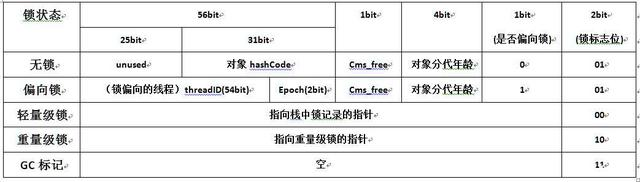
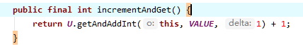
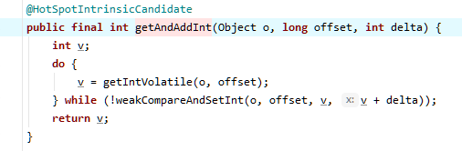
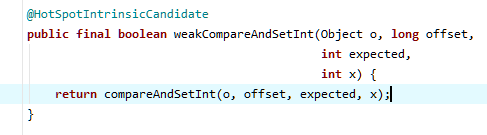

# architect
java架构师课程的一些笔记整理以及代码(src文件夹下有脑图)
## 多线程与高并发
### 1.基础概念
#### 1.1 什么是线程？
作为一个进程里面最小的执行单元它就叫一个线程，简单来说一个程序里不同的执行路径就叫做一个线程
#### 1.2 什么是进程?
做一个简单的解释，你的硬盘上有一个简单的程序，这个程序叫QQ.exe,这是一个程序，这个程序是一个静态的概念，它被扔在硬盘上也没人理他，但是当你双击它，弹出一个界面输入账号密码登录进去了，OK，这个时候叫做一个进程。进程相对于程序来说它是一个动态的概念。
#### 1.3 创建线程的几种方式?
第1种：Thread 
第2种: Runnable 
第3种.Executors.newCachedThrad或者FutureTask+Callable(其实线程池也是使用上面两种方式之一，有点吹毛求疵，可以说线程池或者FutureTask+Callable)
####  1.4 线程的常用方法
**sleep**：sleep意思是睡眠，当前线程暂停一段时间让给别的线程去运行，sleep是怎么复活的?由你的睡眠时间而定，等睡眠到规定的时间自动复活
 
**yield**: 就是当前线程正在执行的时候停下来进入等待队列，回到等待队列在系统的调度算法里头还是依然有可能把你刚回去的这个线程拿回来继续执行，当然，更大的可能性是把原来等待的那些拿出一个来执行，所以yield的意思是我让出一下cpu，后面你们能不能抢到我不管
 
**join**: 意思就是在你自己当前线程加入你调用的join的线程，本线程等待。等调用的线程运行完了，自己再去执行

#### 1.5 线程的状态
**New**：新创建了一个线程对象，但还没有调用start()方法

**Runnable**： 运行状态又包括ready和running，ready状态是说扔到cpu的等待队列里面去排队等待cpu的运行；running状态是等真正扔到cpu上去运行的时候才叫Running运行状态

**Terminal**：线程顺利执行完了就会进入结束状态

**TimedWaiting**：TimedWaiting按照时间等待，等时间结束自己就回去了，Thread.sleep(time)、o.wait(time)、t.join(time)、LockSupport.parkNanos()、LockSupport.parkUntil()这些都是关于时间等待的方法

**Waiting**：在运行的时候如果调用了o.wait(), t.join(),LockSupport.park()进入waiting状态

**Blocked**：在同步代码块的情况下没得到锁就会进入阻塞状态，获得锁的时候就是就绪状态运行。在运行的时候如果调用了o.wait(), t.join(),LockSupport.park()进入waiting状态，o.notify、o.notifyAll、LockSupport.unpark又会回到running状态

#### 1.6几道面试题
1.线程的状态哪些是JVM管理的，哪些是操作系统管理的?
	上面这些状态全是由JVM管理的，因为JVM管理的时候也要通过操作系统，所以呢，哪个是操作系统哪个是JVM他俩分不开，JVM是跑在操作系统上的一个普通程序

2.线程什么状态时候会被挂起？挂起是否也是一个状态？
	Running的时候，在一个cpu上会跑很多线程，cpu隔一段时间执行这个线程一下，再隔一段时间执行那个线程一下，这是cpu的一个调度，把这个线程状态扔出去，从running状态扔回去就叫线程被挂起，cpu控制它(即线程状态从running变为ready状态称为线程挂起)

3.T.class是单例的吗？
	如果是同一个classLoader空间那它一定是。不是同一个类加载器就不是了，不同的类加载器互相之间也是不能访问的，所以说你能访问它，那他一定就是单例

4.synchronized既然能保证有序性，为什么还需要用volatile防止指令重排?
	synchronized只保证了代码的有序性，但是变量的赋值操作依旧可以被编译器优化，此时会发生指令重排序;而volatile就是为了防止编译器指令重排序的。
	哪些情况不会出现代码重排序：满足happens-before或者as-if-serial，则不会出现代码重排序，参考链接，S.x的文章https://franksong.blog.csdn.net/article/details/99190310	

#### 1.7synchronized关键字
**异常锁**: 程序在执行过程中，如果出现异常，默认情况锁会被释放。所以，在并发过程中，有异常要多加小心，不然可能会发生不一致的情况。比如，在一个web app处理过程中，多个servlet线程共同访问同一个资源，这时如果异常处理不合适，在第一个线程中抛出异常，其他线程就会进入同步代码区，有可能会访问到异常产生的数据，因此要非常小心的处理同步业务逻辑中的异常

**synchronized特性**

1.原子性: 原子性就是在执行一个或者多个操作的过程中，要么全部执行完不被任何因素打断，要么不执行

2.可见性:当多个线程访问同一个变量时，一个线程修改了变量的值，其他的线程能立即看到，这就是可见性

3.可重入：如果是一个同步方法调用另一个同步方法，有一个方法加了锁，另一个方法也需要加锁，加的是同一把锁也是同一个线程，那这个时候申请仍然也会得到该对象的锁。

4.有序性：就是程序的执行顺序会按照代码先后顺序进行执行，一般情况下，处理器由于要提高执行效率，对代码进行重排序，运行的顺序可能和代码先后顺序不同，但是结果一样。单线程下不会出现问题，多线程就会出现问题了。

**锁升级**
偏向锁->自旋锁->重量级锁 

偏向锁：第一个去访问某把锁的线程，比如sync(object),来了之后先在这个Object的头上面的markWord记录这个线程。(如果只有第一个线程访问的时候实际上是没有给这个Object加锁的， 在内部实现的时候，只是记录这个线程的ID)，这就叫偏向锁，上图展示了64位JVM中markdown的存储结构

自旋锁：偏向锁如果有线程争用的话，就升级为自旋锁，概念就是(有一个哥们在厕所蹲马桶，另外来了一个哥们，他就在旁边等着，他不会跑到cpu的就绪队列里去，而就在这等着占用cpu，用一个while循环在这儿转圈玩儿，很多圈之后不行的话就再一次进行升级)。

重量级锁：自旋锁转圈十次以后，升级为重量级锁，重量级锁就是去操作系统那里去申请资源。从偏向锁-->自旋锁-->重量级锁这是一个锁升级的过程。

**锁的选择** 
什么时候用自旋锁? 
加锁代码执行时间短，线程数少，用自旋。 

什么时候用系统锁？ 
执行时间长，线程数多，用系统锁 

### 2.解析自旋锁CAS操作与volatile
#### 2.1 volatile作用
 **保证线程可见性**：
 	java里面是有堆内存的，堆内存是所有线程共享里面的内存，除了共享的内存之外呢，每个线程都有自己的专属的区域，都有自己的工作内存，如果说在共享内存里有一个值的话，当我们线程，某一个线程都要去访问这个值得时候，会将这个值copy一份，copy到自己的工作空间里头，然后对这个值的改变，首先都是在自己的空间里进行改变，什么时候写回去，就是改完之后马上写回去。什么时候去检查有没有新的值，也不好控制。在这个线程发生的改变，没有及时的反应到另外一个线程里面，这就是线程之间的不可见。Volatile可以保证一个线程的改变另一个线程能立马看到。volatile本质上是使用了CPU缓存一致性协议MESI来保证可见。
 
 **禁止指令重排序**：
	指令重排序也是和cpu有关系，每次写都会被线程读到，加入了volatile之后。cpu原来执行一条指令的时候，它是一步一步按顺序执行，但是现在的cpu为了提高效率，它会把指令并发的来执行，第一个指令执行到一半的时候第二个指令可能就已经开始执行了，这叫做流水线式的执行。在这种新的架构的设计基础之上呢想充分利用这一点，那么就要求你的编译器把你的源码编译完的指令之后呢可能进行一个指令的重新排序。通过实际工程验证了，效率提高了好多
#### 2.2注意点：
 2.2.1 count++不属于原子操作，如果只加volatile，只能保证可见性，保证不了可见性。所以还需要加上synchronized 
 2.2.2 如果锁对象，请将该对象设置为final,防止锁对象被改变，导致锁失效 
 #### 2.3 锁优化
 **锁细化**： 
 	如果在一个方法中，只需要对其中的一小部分代码进行上锁，那么不要把锁写在睁开方法上，提升性能 
 **锁粗化**: 
 	如果一个方法里面有很多小锁，锁的对象都一样，那还不如弄成一把大锁，这样减少锁和解锁的次数，提升性能 
 #### 2.4 CAS关键字
 ##### 2.4.1 CAS介绍
 CAS号称无锁优化，或者叫自旋。名字无所谓，主要得理解它的意思。在jdk中，以Atomic开头的类都是以CAS这种操作来保证线程安全的。AtomicInteger的意思就是里面包了一个int类型，这个int类型的自增count++是线程安全的，还有拿值也是线程安全的，由于我们在工作中经常遇到一个值所有线程共同访问它往上递增，所以，jdk专门提供了这样一些类

 ##### 2.4.2 CAS源码
 让我们来通过AtomicInteger来了解CAS，

AtomicInteger类源码(JDK11的源码) 

Unsafe类源码(JDK11的源码)

##### 2.4.3 CAS原理
可以在unsafe类中看到weakCompareAndSetInt方法中调用了compareAndSetInfo方法，CAS全称是compare and swap（比较和交换），在java代码中是compareAndSet，java代码实际上调用的是底层C++代码，C++代码的方法名是compareAndSwap,该方法有4个参数，第1个参数就是你要设置值的对象，第2个参数表示该字段在该类在内存的偏移量，第3个参数是期望当前值会是几，第4个参数是你要设置的新值。比如我期望你的值是0，你不能是1，否则我就认为在我这个线程修改的过程中值已经被其他线程修改过了，如果出现这种情况，我就再循环一次，重新获取新的值，在新值的基础上加1，直到设置成功为止。

##### 2.4.4 ABA问题
**问题描述** 
这个ABA问题是这样的，假如说你有一个值，我拿到这个值是1，想把它变成2，但是在变成2之前，有另一个线程已经把改值变为2再变成1了，这就是ABA问题 

**解决方案** 
第1种情况：如果是基础类型，无所谓，不会影响结果值 
第2种情况：如果是引用类型，加上版本号字段，每修改一次版本号加1，在检查的时候期望值和版本号一起检查 

### 3. Atomic类和线程同步机制
为什么Atomic要比sync快? 
因为Atomic不加锁,synchronized是要加锁的，有可能去操作系统申请重量级锁，所以sync效率偏低 

LongAdder为什么要比Atomic效率要高呢? 
因为LongAdder内部做了一个分段锁，在内部的时候，会把一个值放到一个数组里，比如说数组长度是4，最开始是0，1000个线程，250个线程锁在第一个数组元素里，以此类推，每一个都往上递增算出来的结果再加到一起。个人理解就是sync是一个锁，多个线程竞争同一把锁，而LongAdder是多个锁，锁的个数就是LongAdder内部数组长度，比如数组长度为4时，有4个锁，线程获取到锁的几率就会大一点，等待时间少一点，所以效率高 